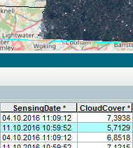
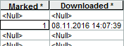



## Purpose
The purpose is to provide assistance to occasional users to deal with Sentinel data in a local ArcGIS Desktop environment by means of two Python Toolbox tools and common ArcGIS Desktop experience:

1. **Search** Data Hub Services' (DHuS) product catalog for Sentinel-2 products (L1C, or L2A where available) according to given criteria (in particular spatiotemporal constraints and cloud cover limit).  
  The search results are stored in a local product catalog (raster catalog) acting as a controllable cache (for product metadata and previews).  
  
2. Interactively browse metadata (attribute table) and product previews (by selecting product records); mark desired product records for download.
3. For each _Marked_ entry in the local product catalog, **Download** the respective raster data package.  
  

Upon download success, the respective raster datasets are displayed in ArcMap.

#### Characteristics
* Specific to Level-2A (L2A) products, various optional water indices are offered (NDWI*, MNDWI*, WRI*, MBWI, WI2015*, AWEInsh*, AWEIsh*, [etc.](doc/Indices.pdf)), along with optional supplementary functionality (i.e. additional binary mask layers derived from the respective cloud or snow/ice image, as well as cloud or snow/ice filtering for filterable* indices):  
  .")  
  <sup>The screenshot illustrates the Rhine flood of January 2018 nearby the city of Rees (Germany), where the water bodies of the pre-flood situation (T31UGT_20171119T104331) are displayed in yellow, whereas the water bodies of the flood situation (T31UGT_20180108T104421) are displayed in pink.</sup>  
  The index calculations are performed on the fly by means of ArcGIS' raster functions. The respective function chain declaration is script-generated, e.g. the script line for generating a MNDWI index layer reads (with applied threshold value of 0.05):  
  ```python
  index(BandArithmetic(CompositeBand("F32", B["03"], Resample(B["11"])), "(b1-b2)/(b1+b2) -5/100"))
  ```
  This allows for individual modifications, for example to adjust the default threshold value, to extensively modify a formula's arithmetic expression, to rearrange the function chain, or to quickly implement your very own index.  
  :bulb: Tip: Try out different thresholds to find the most appropriate one with respect to the scene's specific circumstances.  
  All indices are more or less sensitive to the variability of certain conditions like seasonal changes (notably shadow), water turbidity, content of phytoplankton, and so on.
* As to L2A products: The newer version (≥14.5) of the Products Specification Document (PSD), which has been introduced with the [operational](https://scihub.copernicus.eu/news/News00305) distribution of L2A products, is taken into account.  
  The *Search* tool transparently merges search results relating to the (old) Level-2Ap pilot collection (which still provides those L2A products that are dated before 2018-03-26, i.e. having a processing baseline number not higher than 02.06) with search results relating to the (new) operational Level-2A collection (L2A products from 2018-03-26 onwards, i.e. tagged with a processing baseline number from 02.07 onwards).  
  :bulb: Tip: A product's processing baseline number is identifiable by means of its "\_N....\_" tag as part of its title string.
* For L2A products with processing baseline number not higher than 02.06 (for example, those originating from the aforesaid Level-2Ap pilot collection), ArcGIS 10.6 provides various function templates with its [built-in](http://desktop.arcgis.com/en/arcmap/latest/manage-data/raster-and-images/satellite-sensor-raster-types.htm) Sentinel-2 raster product type. The 10 meter Bottom-Of-Atmosphere (BOA) template is added to the L2A Group Layer.  
  L2A products that have a processing baseline number *higher* than 02.06 (i.e. products from the aforesaid operational L2A collection) are not yet supported by ArcGIS' Sentinel-2 raster product type. In this case, no BOA-template-based layer can be presented.
* L2A products, available from ESA's Copernicus Open Access Hub ([SciHub DHuS](https://scihub.copernicus.eu/dhus)) since begin of May 2017, are taken into account as an option. The _Download_ tool displays a L2A product by a Group Layer, composed of confidence images for cloud (CLD) and snow/ice (SNW), a scene classification image (SCL), and a natural color composite (TCI, plus BOA where applicable), along with appropriate symbology:  
  
* Irrespective of the existence of a specific product in the specified local raster directory, the _Download_ tool generates the corresponding output layer(s), even though all redundant download actions have been skipped. This might be useful when you simply want to recreate those layers incl. appropriate symbology.
* The python interpreter automatically takes proxy server settings into account, either based on respective Internet Explorer settings, or based on the two environment variables `https_proxy` + `http_proxy` (incl. optional Basic Authorization. See the proxy-example*.* files within the [doc](doc) directory).
* CODE-DE support (since March 2017): The [German mirror site provides DHuS](https://code-de.org/dhus) similary to Copernicus Open Access Hub (SciHub site). The Toolbox tools do now allow for choosing CODE-DE as an alternative DHuS site (in addition to the mainstream DHuS at SciHub site).  
  📓 **Note**: It may happen that certain data sets are missing at CODE-DE site. If in doubt, rerun the respective tool against the reference DHuS at SciHub site.
* ArcGIS 10.5.1 now supports the newer PSD version (≥14) in terms of a built-in raster product type. ArcGIS versions lower than 10.5.1 lack such support. As a substitute, the natural color composite (TCI) is then used for the _Download_ tool output parameter.
* A multi-tile package is represented by multiple records in the search results table (raster catalog) rather than by one single product record. This way each tile preview can be examined individually. When it comes to downloading such a multi-tile product, the _Download_ tool treats those multiple records as a single entity, i.e. a single (full) product download will be performed regardless of how many tiles are _Marked_.  
   Over time, this kind of quirk loses its relevance because newer products (those provided since the end of September 2016) are provided solely as single-tile packages.
* Contrary to the previous point: When using the "Image selection" mode of the _Download_ tool, the download of product images is performed with _Marked_ tiles only, i.e. non-marked tiles are actually ignored even if they are part of a multi-tile package.

## Prerequisites
* Valid login credentials for DHuS at either one of the following
    * Copernicus Open Access Hub: https://scihub.copernicus.eu/dhus/#/self-registration
    * CODE-DE site: https://code-de.org/dhus/#/self-registration
* Tested with ArcMap/ArcCatalog version 10.4.1, 10.5, 10.5.1, 10.6, 10.6.1 (not suitable for ArcGIS Pro until further notice).
* Regarding ArcMap 10.4.1:
  * [ArcGIS 10.4.1 Raster Patch](http://support.esri.com/Products/Desktop/arcgis-desktop/arcmap/10-4-1#downloads?id=7396).
  * On affected systems: [ArcGIS Runtime Error R6034 Patch](http://support.esri.com/download/7391).
* Regarding the availability of water indices (and supplementary functionality):
  * ArcGIS 10.5 (or higher) for proper Expression parsing of an index' Band Arithmetic Function.
  * Spatial Analyst extension for supplementary functionality (additional binary mask layers for cloud or snow/ice, cloud or snow/ice filtering for filterable* indices).

## Getting Started
* [Download ZIP](../../archive/master.zip) and extract its content to a local directory that can be reached by an ArcCatalog _Folder Connection_.  
  Make sure that the original file structure is preserved (relative paths); all referenced files have to be properly placed with respect to the main Toolbox files (.pyt, \*.xml), by name sensub.py and all \*.lyr files within their respective subdirectory.  
  📓 **Note**: Do not simply drag and drop the Toolbox icon to a desired ArcCatalog _Folder Connection_ (e.g. "My Toolboxes"), because by doing so ArcCatalog copies only the Toolbox .pyt file in conjunction with its belonging *.xml help files but leaves out all other dependent files!
* Before using the tools, it is highly advised to read the respective _Item Description_ of the Toolbox and of each tool in advance (see respective context menu in ArcMap), particularly the _Usage_ of each tool (also reachable from each _Tool Help_). Amongst others, the _Usage_ of the _Search_ tool introductorily explains some general ArcMap settings that have to be carried out in advance.  
  When running the parameter form of a particular tool, consult the respective _Parameter Explanation_ shown in the side panel (button "Show Help >>" opens the side panel).
